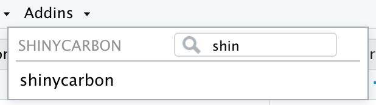
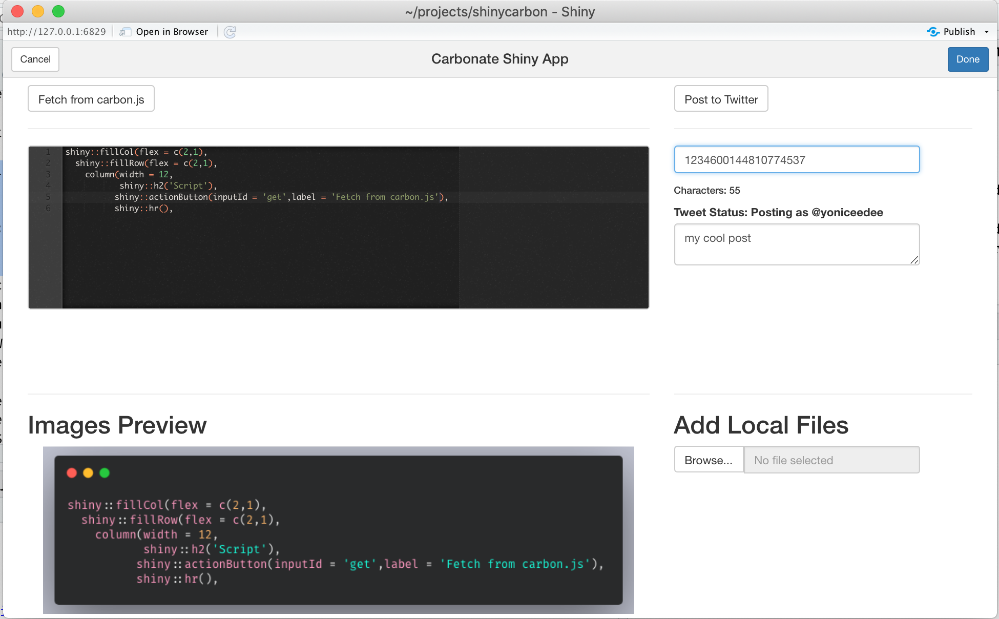

<!-- README.md is generated from README.Rmd. Please edit that file -->

```{r, include = FALSE}
knitr::opts_chunk$set(
  collapse = TRUE,
  comment = "#>",
  out.width = "100%"
)
```

# shinycarbon

<!-- badges: start -->
[](https://www.tidyverse.org/lifecycle/#experimental)
<!-- badges: end -->

The goal of `shinycarbon` is to create a shiny wrapper to make it easy to share {carbonate} images on twitter.

## Installation

You can install using: 

```r
remotes::install_github("yonicd/shinycarbon")
```

## Loading the App


```{r example,eval=FALSE}
library(shinycarbon)
```

There are two ways to load the app

Command line

```{r, eval=FALSE}
shinycarbon::run_app()
```

Addin

```{r,echo=FALSE,out.width = "40%"}

```

## Preloading Script

If you are in RStudio you can pre-load the app with script by highlighting text and running the addin.

## Layout

The basic app layout is pretty straight forward:

  - Top right is a `shinyAce` editor to put in the code you want to send to `carbon.js` using the button above it.
  - Bottom right is where the images come out to preview them in a `slickR` carousel.
    - Remember only 4 images per tweet, more images will automatically be converted into a gif
  - Bottom left is a button to import images from you local machine into the carousel
    - Handy for capture screen and what not...
  - Top left is where you construct your tweet for `rtweet`.
    - The app uses the System Variable 'TWITTER_SCREEN_NAME' as the tweeting handle.
    - You can reply to tweet by inserting the tweet id into the 'enter reply status id' field
    - Write your post into the text area, don't worry about handles for a reply that is taken care for you under the hood.
    - Your character count is shown above the text area for convenience. If there are reply handles that are added the character count will take them into account.

Here is a screenshot:

```{r,echo=FALSE}

```
